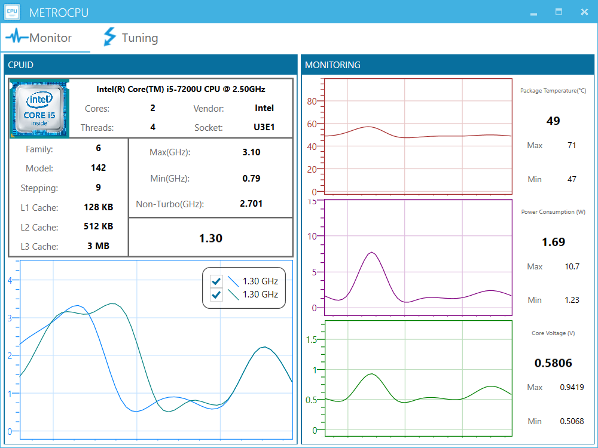
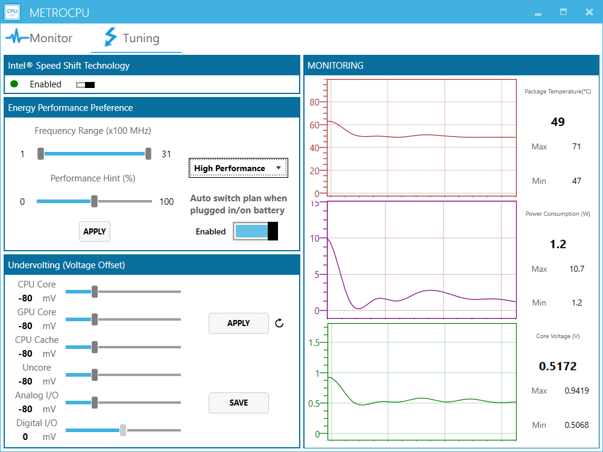
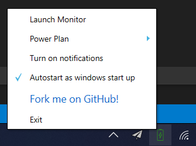

# MetroCPU 
> A CPU Tweaker which enables you to adjust the cpu frequency precisely as well as automatically switches the power plan of your laptop to extend its battery life.

# Screenshots
Tab1: basic info and clock monitor

Tab2: power plan settings and other monitors

Tray Shortcut

